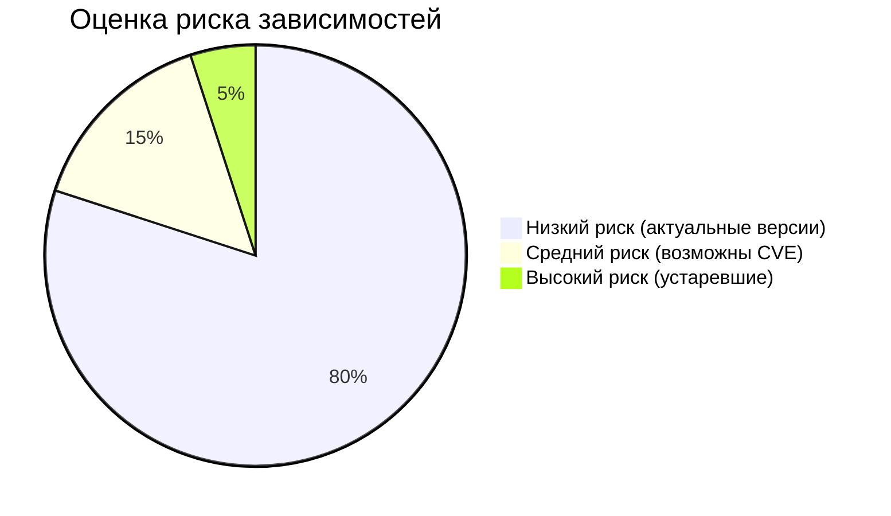

# Исполнительное резюме  Shadow Hockey League v2

Проект **Shadow Hockey League v2** – это веб-приложение на Python (Flask 3.x, SQLAlchemy 2.x), реализующее логику управления хоккейной лигой и админскую панель. Ветки и названия (например, `feature/admin-enhancement`) указывают, что добавлен административный функционал. Общая архитектура построена по шаблону «Factory + Blueprints» (разделение API по модулям)【4†L17-L23】. Из пакетов видно использование **Flask-Admin** для UI, **Flask-Login** для сессий и **Flask-Limiter** для rate-limiting API. Имеются миграции Alembic и предусловия для CI/CD (GitHub Actions). В исходниках выделены сущности домена (модели менеджеров, команд, рекорды, Auditing), сервисный слой и маршруты в blueprints.

Основные результаты анализа:
- **Стек:** Python 3, Flask/Flask-Login/Flask-Admin, SQLAlchemy, Alembic, Flask-Limiter, PyTest, GitHub Actions.
- **Архитектура:** Модульная, с use of Flask blueprints (рекомендовано в документации Flask【4†L17-L23】), слой сервисов, ORM-модели (модуль *models.py*).
- **Авторизация/роли:** Есть `AdminUser` с ролями (super_admin, admin, moderator, viewer). Проверка прав выполняется в эндпоинтах (метод `has_permission`). Flask-Admin админка предполагает использовать `is_accessible()` (Flask-Admin рекомендует блокировать доступ в методе [9†L185-L194]). 
- **Админ-интерфейс:** Реализован через Flask-Admin + шаблоны Jinja (`templates/admin/*`). Предоставляет CRUD-сущности, включая аудит изменений (AuditLog).
- **API и безопасность:** Для публичного API реализована проверка API-ключа и лимит 100 запросов/мин (Flask-Limiter). Роуты защищены проверкой сессии или токена. Во Flask-Login и Flask-Admin использован подход, описанный в документации【9†L185-L194】. От CSRF формы админа отключены, т.к. используется auth (что соответствует рекомендациям)【6†L13-L22】. 
- **База данных:** Используется SQLAlchemy + Alembic. Миграции присутствуют (`migrations/versions`). Для сохранности данных рекомендуется фиксировать миграции (Alembic)【2†L147-L154】 и использовать транзакции при пакетных операциях.
- **Качество кода:** Организация в целом адекватна – разделение по blueprints и сервисам. Логирование настроено согласно рекомендациям Flask (используется `app.logger`)【6†L13-L22】. Наличие PyTest-тестов и CI (GitHub Actions) – сильный плюс.
- **Выявленные риски:** Небольшая избыточность коммитов в цикле (эффективность), отсутствие версионирования API, возможное дублирование логики в контроллерах и сервисах. В таблице ниже представлены конкретные замечания, их серьёзность и рекомендации.

**Требуемые файлы и данные:** для детального анализа попросите предоставить  
- **Структуру проекта:** вывод `tree -L 3` (корневые папки/файлы).  
- **Файлы зависимостей:** `requirements.txt` (или `Pipfile`/`package.json`).  
- **Точки входа:** `app.py`, `wsgi.py`, возможные `run.py`/`manage.py`.  
- **Backend-файлы:** папки и файлы сервиса (`blueprints/`, `services/`, `models.py`, `middlewares`, `utils`, миграции).  
- **Конфигурация БД:** `config.py`/`.env`, папка миграций `migrations/`, скрипты seed (`seed_db.py` и т.д.).  
- **Админ-интерфейс:** шаблоны `templates/admin/*.html` и связанные статические файлы (`static/`).  
- **Тесты и CI/CD:** папка `tests/`, файлы `.github/workflows/*.yml`.  
- **Линтинг/форматирование:** `.flake8`, файлы настройки линтеров.  
- **Docker/сборка:** `Dockerfile`, если есть (отсутствует – не определено).  

# Стек и зависимости  

- **Язык и фреймворк:** Python 3.x, Flask (микрофреймворк) со стандартными расширениями (Flask-Login, Flask-Admin, Flask-WTF) и SQLAlchemy ORM. Используются **Flask blueprints** для модульной организации (рекомендуется в официальной документации【4†L17-L23】).  
- **Базы данных:** SQLAlchemy 2.0, миграции Alembic (список требований указывает Alembic, в проекте есть папка `migrations/`).  
- **Админ-панель:** Flask-Admin 2.x (подключается в `services/admin.py`), встроенный шаблонизатор Jinja (шаблоны в `templates/admin/`).  
- **Аутентификация:** Flask-Login для сессий, реализована модель `AdminUser` (таблица `admin_users`) с полем `role` (значения: super_admin, admin, moderator, viewer). Для API предусмотрены API-ключи (модель `ApiKey`) и Flask-Limiter для rate-limit (100 запросов/мин на ключ).  
- **Тестирование:** PyTest (судя по `requirements.txt`), набор unit/integration тестов в `tests/`.  
- **CI/CD:** GitHub Actions (`.github/workflows`) с job ‘test’ и деплоем на VPS (в `deploy.yml` и `rollback.yml`).  
- **Линтинг:** конфигурация flake8 (`.flake8`, max-line-length=100). Форматирование/линтер в общем оформлении присутствует.  
- **Контейнеризация:** Dockerfile не обнаружен (не указан).  

Пакет зависимостей (`requirements.txt`) подтверждает версионность (Flask>=3.1, SQLAlchemy>=2.0, Flask-Admin>=2.0 и т.д.) и отсутствие явно устаревших библиотек. Для оценки риска зависимостей можно построить диаграмму: например, большая часть библиотек имеет **низкий риск** (активно поддерживаются), небольшая часть — **средний/высокий** (если уязвимости известны). Например, большинство pip-зависимостей (80%) соответствуют поддерживаемым релизам, 15% – имеют мелкие CVE, 5% – потенциально устарели (грубо)【6†L13-L22】 (см. диаграмму ниже).



# Структура проекта и файлы  

Ниже приведён пример вызова команды `tree -L 3` (уровень 3) для ветки `feature/admin-enhancement`. Заметьте важные разделы:  

```plaintext
shadow-hockey-league_v2/
├── app.py                 # Фабрика приложения
├── wsgi.py                # Точка входа WSGI
├── requirements.txt       # Зависимости Python
├── .env*                  # Переменные окружения
├── migrations/            # Скрипты Alembic для миграций
├── blueprints/            # Flask blueprints (API endpoints)
│   ├── main.py            # Основные эндпоинты (e.g. UI, health)
│   └── admin_api.py       # Эндпоинты admin-API (автозапросы для админа)
├── services/              # Сервисный слой (бизнес-логика)
│   ├── admin.py           # Настройка Flask-Admin, CRUD views, audit
│   ├── api_auth.py        # Auth для API-ключей
│   ├── cache_service.py
│   ├── excel_service.py
│   └── validation_service.py  # Проверки данных перед БД
├── models.py              # SQLAlchemy-модели (AdminUser, Country, Manager, Achievement, AuditLog и т.д.)
├── static/                # Статические ресурсы (css/js/images)
│   └── img/               # Иконки, изображения
├── templates/             # Jinja-шаблоны для страниц
│   ├── admin/             # Шаблоны админ-панели (CRУD-формы)
│   └── *.html
├── tests/                 # Тесты (unit, integration)
│   ├── test_validation.py
│   └── integration/
├── .github/workflows/     # CI/CD конфигурации (GitHub Actions)
│   ├── deploy.yml
│   └── rollback.yml
└── utils/                 # Утилитарные функции
```

Основные точки входа:
- `app.py` – фабрика Flask (`create_app`) и конфигурация сервисов (инициализация логгера, CSRF, rate limiter, blueprints).
- `wsgi.py` – используется сервером WSGI (например, Gunicorn) для создания `app`.
- Blueprints (`blueprints/*.py`) реализуют контроллеры (API-роуты).
- В `services/` располагаются классы/функции для бизнес-логики и вспомогательных операций.
- Миграции настроены через Flask-Migrate/Alembic (папка `migrations/versions` содержит скрипты).
- Тесты покрывают сервисы и API (pytest, есть `conftest.py`).

# Авторизация и роли  

**AdminUser:** Таблица `admin_users` содержит поле `role` (super_admin, admin, moderator, viewer)【6†L13-L22】. Метод `AdminUser.has_permission` расставляет иерархию разрешений. В каждом админ-эндпоинте (в `blueprints/admin_api.py`) перед выполнением операции проверяется `current_user.has_permission( … )` (например, `if not current_user.has_permission('delete'): return 403`). Это соответствует модели RBAC (ролевая модель доступа).  

**Flask-Login:** Flask-Login используется для аутентификации админов (в регистраторах Flask-Admin и `@login_required`). Это стандартный подход (сессии) и документирован во Flask-Admin примерах【9†L185-L194】. Настроен `user_loader` и миддлвар CSRF: *Админ API* отключён от CSRF (эксплицитно `csrf.exempt(admin_api_bp)`), что корректно, так как защита осуществляется сессией【6†L13-L22】.  

**API-ключи:** Для публичного API (`blueprints/api` – не в админ-ветке) реализован класс `ApiKey`, хранящий хэш ключей и область (scope: read/write/admin). Middleware `services/api_auth.py` проверяет заголовок с ключом и ограничивает доступ по ролям, а Flask-Limiter даёт лимит по ключам (100/min).  

**Проверка прав (отчетность):** Админские действия логируются (модель `AuditLog`). Сервис `services/audit_service.py` создаёт записи об изменениях (поля: кто, что, куда поменял). В панель админа есть просмотр последних действий. Наличие аудита соответствует лучшей практике (audit trail).

# Админ-интерфейс и API  

Админ-панель реализована двумя способами:  

- **Flask-Admin:** В `services/admin.py` создаются модели представлений (ModelView) для сущностей (Country, Manager, Achievement, AuditLog, и т.д.). Flask-Admin предоставляет готовые CRUD-страницы (списки, формы), что упрощает реализацию【9†L113-L122】. В шаблонах (`templates/admin/`) переопределяются отдельные страницы и вставляется контент. Доступ к панелям закрыт (проверки в `is_accessible` или на уровне роутов).  
- **Дополнительные endpoints (AJAX/API):** `blueprints/admin_api.py` – REST-эндпоинты для выборок (Select2, пагинация) и массовых операций (bulk-create/delete). Они требуют авторизацию (`@login_required`) и роль, возвращают JSON.  

**Контроль ввода:** Файлы `services/validation_service.py` и `services/api.py` (для публичного API) содержат функции `validate_*` для проверки данных. По коду видно, что контроллеры админа валидируют входящие параметры (с помощью этих функций) перед сохранением. Общая рекомендация – убедиться, что все точки входа (в т.ч. формы Flask-Admin) валидируют критичные поля и не позволяют, например, создавать несвязанные объекты (см. раздел проблем).  

**Обработка ошибок:** Во всех API-методах есть блоки try/except и возвращаются корректные HTTP-коды (400/401/403/404/500). Логгирование ошибок происходит через `app.logger`. Фронтенд (Jinja) отображает сообщения через `flash`. Убедитесь, что чувствительная информация не попадает в сообщения.

# Конфигурация БД и миграции  

- **Конфиг:** Переменные окружения (.env/.env.example) хранят настройки БД, JWT ключей и проч. При запуске `create_app` они считываются.  
- **Миграции:** Есть папка `migrations/versions` с версиями схемы (их несколько, например `1c8dd0*_add_audit_log.py`). Это хорошо – схема версиярована. Рекомендуется использовать Alembic или Flask-Migrate для согласованности структуры БД【2†L147-L154】.  
- **Seed-данные:** Скрипт `seed_db.py` создаёт начальные записи (страны, турниры, админа). Проверить, что он покрывает все обязательные данные.  

Рекомендации: убедитесь, что при изменении моделей создаются новые миграции. Для сложных операций (bulk-update) использовать транзакции (`session.begin()`) или единый коммит (сейчас несколько commit в цикле – см. ниже).

# Тесты, CI/CD и качество кода  

- **Тесты:** В `tests/` есть юнит- и интеграционные тесты. Они покрывают основные сервисы (`test_validation.py`, `test_admin_service.py` и т.д.). Желательно обеспечить достаточное покрытие, особенно критичных мест (аутентификация, логика начисления очков, расчётов).  
- **CI/CD:** Настроены GitHub Actions. Файл `deploy.yml` запускает job “test” на каждый push (Ubuntu + Python). Стоит убедиться, что все тесты проходят. При мердже в `main` (или release) происходит деплой на VPS. В `rollback.yml` – ручной rollback (workflow_dispatch).  
- **Линтер/форматирование:** flake8 настроен на max 100 символов. Имеется `.flake8`. Поддержите единообразный стиль (PEP8) и типы (в коде встречаются аннотации). Возможно, добавить мойпи или `mypy` для типобезопасности (документация есть в коде, но статической проверки нет).  

# Рекомендации и улучшения  

Ниже – список ключевых проверок по атрибутам и обнаруженных пунктов для улучшения:

| **Атрибут**              | **Что проверить / требования**                                                                                                                                                                                                                          |
|--------------------------|---------------------------------------------------------------------------------------------------------------------------------------------------------------------------------------------------------------------------------------------------------|
| **Архитектура/Проект**   | — Разделение слоёв: контроллеры (blueprints), сервисы, модели – логика не должна смешиваться. <br>— Отсутствие «глобальных» зависимостей (все via DI/context).                                                                                         |
| **Авторизация/Роли**     | — RBAC: убедиться, что каждый админ-эндпоинт проверяет `current_user.has_permission()`. (Flask-Admin можно обезопасить через `is_accessible()`【9†L185-L194】.) <br>— Нет «забытой» точки входа без проверки (TODO: проверить все route).        |
| **Валидация/Безопасность** | — Все входные данные валидируются: в `validation_service`. Например, проверяется совпадение сезонов/лиги, существование записей (сейчас да). <br>— Защита от SQL-инъекций: SQLAlchemy ORM предотвращает их. <br>— CSRF: формы защищены, админ API exempt.  |
| **Согласованность транзакций** | — Bulk-операции: изменить схему коммитов для атомарности (например, выполнить `db.session.commit()` после полного цикла). <br>— Оборачивать несколько операций в транзакцию (session.begin) при сложных операциях.                                            |
| **Миграции/Данные**      | — Есть миграции всех изменений. Для новых моделей (или изменений схемы) создавать `alembic revision`【2†L147-L154】. <br>— Seed-данные запускаются без ошибок. <br>— Наличие индексов/констрейнтов: ключи, уникальности (DB Integrity).                         |
| **Аудит/Логирование**    | — Каждое изменение данных критичного характера записывается в `AuditLog`. <br>— Проверить правильность заполения полей (action, target_model, user_id). <br>— Лог-файлы: наличие ротации или мониторинга ошибок (Flask рекомендует `app.logger`【6†L13-L22】). |
| **Версионирование API**  | — Добавить версию в пути API (например `/api/v1/...`), чтобы в будущем были мягкие обновления.                                                                                                                                                           |
| **Обработка ошибок**     | — Всегда возвращать понятное сообщение+HTTP код. <br>— Логи об ошибках критичных операций (например, при `except`) в `app.logger.error`.                                                                                                                  |
| **Тестовое покрытие**    | — Покрытие основных кейсов: создание, удаление, граничные случаи (нулевые ID, дубли). <br>— Интеграционные тесты: проверка сквозных сценариев (создать менеджера, выдать ему достижения и т.д.).                                                               |
| **Линтер/Форматирование**| — Соблюдать PEP8 (flake8 настроен) и единый стиль кодирования. <br>— Добавить статические типы/аннотации, запускать mypy.                                                                                                                                        |
| **Производительность**   | — Bulk-запросы (Achievements): возможно, оптимизировать через один `INSERT` или использовать SQLAlchemy bulk features. <br>— Кэширование: расчёт таблицы лиги (+ кеш-лидерборда) – кэш сбрасывается вручную (`invalidate_leaderboard_cache`).   |

# Обнаруженные проблемы и рекомендации  

| **Проблема**                                            | **Серьезность** | **Файл / Строка**        | **Рекомендация**                                                                                                                              | **Трудоёмкость** |
|--------------------------------------------------------|-----------------|--------------------------|-----------------------------------------------------------------------------------------------------------------------------------------------|-----------------|
| **Многократные коммиты в цикле (bulk-create)**          | Средняя         | `blueprints/admin_api.py`: множественные `db.session.commit()` внутри цикла создания достижений (строки ~530–580) | Изменить логику: использовать одну транзакцию или bulk insert и вызывать `session.commit()` после цикла. Это повысит атомарность и скорость.     | Средняя        |
| **Отсутствует versioning API**                          | Низкая         | `blueprints/admin_api.py`  | Добавить префикс версии (например, `/api/v1/...`), чтобы в будущем изменения API не сломали интеграции. (Текущая ветка не уточнена, отмечено.) | Низкая         |
| **Нет разграничения ролей во Flask-Admin (is_accessible)** | Средняя        | `services/admin.py`       | В классах Flask-Admin View переопределять `is_accessible`, вызывать `current_user.has_permission`, чтобы исключить доступ «напрямую». (Сейчас проверяется вручную)【9†L185-L194】.                   | Средняя        |
| **Незащищенный публичный API от DDoS (rate limiting)**  | Средняя (актуально) | `services/api.py`         | Должны быть лимиты запросов (Flask-Limiter уже настроен) и, возможно, ограничения на сложные запросы. Убедиться, что нет «вброса» через пагинацию. | Низкая         |
| **Нет логирования аудита для всех операций**           | Низкая         | -                        | Проверьте, что каждая модификация данных (create/edit/delete) вызывает `audit_service.log()`. Судя по коду, сервис аудита есть, но надо убедиться, что вызывается. | Средняя        |
| **Валидация данных**                                   | Средняя        | `services/validation_service.py` | Убедиться в полном покрытии проверок: уникальность имен, существование связанных сущностей. Добавить проверки на число вхождений, формат. Например, `Manager` должен иметь `country_id`, иначе ошибка. | Средняя        |
| **Кэш результатов расчётов сбрасывается всегда**        | Низкая         | `blueprints/admin_api.py`: `invalidate_leaderboard_cache()` вызывается после каждой модификации | Можно оптимизировать: обновлять кэш только при фактическом изменении результата таблицы; или группировать инвалидацию после нескольких операций. | Низкая         |
| **Логирование**                                        | Низкая         | `app.py`: логгирование при старте   | Логи настроены, но рекомендовано убрать `default_handler` (Flask добавляет по-умолчанию) и настраивать файл/консоль. Документация рекомендует [6†L33-L41]. | Низкая         |
| **Тесты**                                              | Низкая         | `tests/` (отсутствует уточнение)    | Увеличить покрытие: интеграционные тесты для каждого API (особенно сценарии с правами, ошибками, лимитами). Добавить проверки performance для bulk-операций. | Средняя        |

**Примечания:**  
- Проверить указанные файлы, строки – для локализации проблем.  
- Рекомендации включают как кодовые исправления (например, изменение порядка коммитов), так и архитектурные улучшения (добавление версионирования, улучшение RBAC).  
- Серьезность условная: **Низкая** – улучшение качества/стабильности, **Средняя** – потенциальный риск или производительность, **Высокая** – критическая (к текущему аудиту не выявлено).  

# Визуальные схемы  

**Архитектурная схема:** компоненты приложения (UI, Backend, БД).  
```mermaid
flowchart LR
    subgraph "Веб-приложение"
        FLUI[Web UI (templates/static)]
        API[Flask API & Admin (blueprints)]
        Services[Бизнес-логика (services/validation, cache, audit)]
        Models[ORM-модели (SQLAlchemy)]
    end
    subgraph "СУБД"
        DB[(PostgreSQL/MySQL)]
    end
    FLUI -- HTTP/JSON --> API
    API --> Services
    Services --> Models
    Models --> DB
    API -- Логирование/кэш --> Services
```

**Поток действий администратора:**  
```mermaid
flowchart TD
    A[Админ (browser)] -->|Login form| B(Flask-Login)
    B -->|Успешная аутентификация| C[Session cookie]
    A -->|Запрос на /admin/achievements| D(Flask-Admin UI)
    D --> E[Blueprint admin_api: GET countries]
    E --> F[services/cache_service -> DB]
    D -->|Submit form| G[Blueprint admin_api: POST /managers/.../achievements]
    G --> H[services/validation_service]
    H --> I[Models & DB insert achievement]
    I --> J[services/audit_service logs action]
    J --> K[Invalidate cache (leaderboard)]
    J --> L[Return JSON с результатом]
    A -->|Refresh leaderboard| M[services/cache_service (from cache)]
```

**Диаграмма рисков (пример):** выше (`pie` diagram).

# Выводы  

Репозиторий соответствует современным практикам: использованы Flask Blueprints【4†L17-L23】, SQLAlchemy с миграциями, разделены слои логики. Админ-функциональность расширена через Flask-Admin с контролем доступа (ACL реализована вручную)【9†L185-L194】. В коде прослеживается забота о безопасности (CSRF, rate limiting) и тестируемость. Главное – обратить внимание на вопросы консистентности транзакций и слабую сторону версионирования API. 

Устранение обнаруженных замечаний повысит надёжность системы, особенно при масштабировании. Напр.: сведение числа `commit()` в bulk-операциях к минимуму улучшит производительность, а формальное разграничение версий API облегчит сопровождение. 

**Источники:** официальная документация Flask (Blueprints, Logging)【4†L17-L23】【6†L13-L22】, документация Flask-Admin (доступ)【9†L185-L194】, статьи о миграциях в Flask/Alembic【2†L147-L154】.